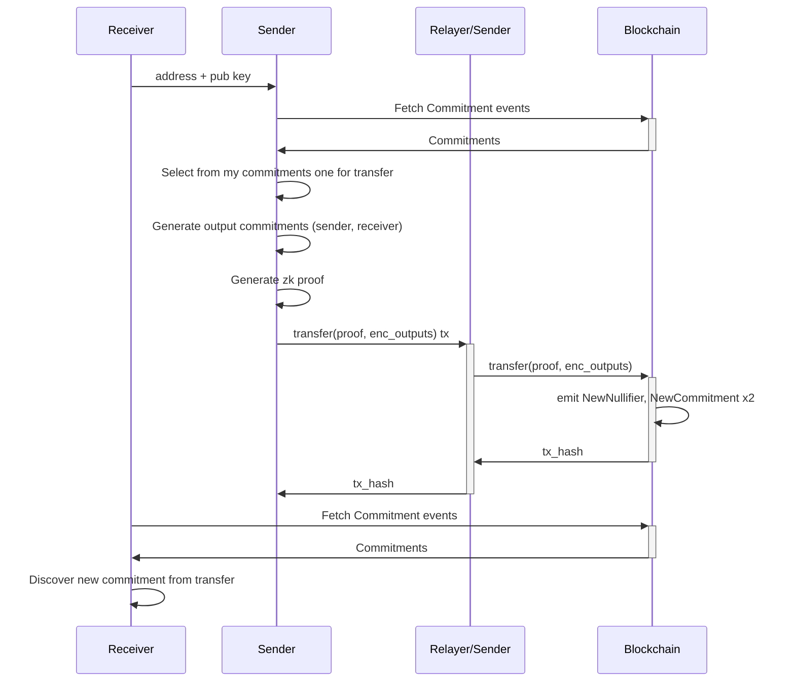
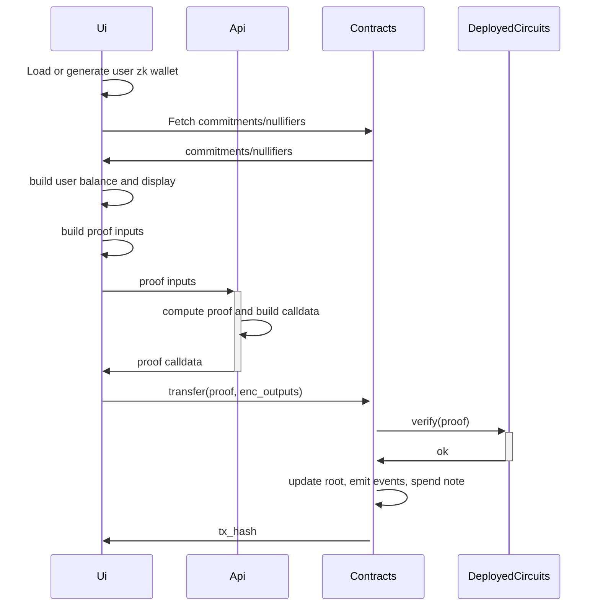

# Private ERC20

## Overview

Design is inspired in privacy pools like [tornado nova](https://github.com/tornadocash/tornado-core/tree/master) and [zcash](https://github.com/zcash/orchard)

### Definitions

**Note**:
A "note" represents ownership information over a certain amount of tokens. The hash of this information is called the commitment and is stored in the contract's Merkle tree. The user balance is the sum of these notes.

**Nullifier**
The nullifier is a unique value derived from a note to prevent double-spending. It is significant because it can only be created by the owner and is unequivocally linked to a single note. This is achieved by using the hash of the note to prevent any attempt at double-spending.

**Keypair**
The user's wallet consists of an RSA keypair used for asymmetric encryption. Certain relevant information required to use a note is encrypted with the owner's public key and published in the `NewCommitment` event. This ensures that only the user with the corresponding private key can access it. The public and private keys follow standard RSA conventions. For the address, we currently define it as `hash(private_key)` to quickly validate ownership in circuits, as there is no support for RSA key derivation in Noir. One alternative being explored is using [signatures](https://noir-lang.org/docs/reference/NoirJS/noir_js/functions/ecdsa_secp256k1_verify), though this feature is not yet implemented.

**Relayer**
A relayer is a service that can further enhance user privacy. While blockchain calldata does not expose any data about amounts or zk addresses, submitting transactions directly reveals the user's Starknet wallet address, potentially leaving a trace of their participation. To address this, a relayer can submit transactions on behalf of users, effectively obscuring their wallet address and improving privacy.


### How it all works

**Initial Minting Process**

Currently, the deployer is responsible for creating the first commitment by specifying the `MERKLE_TREE_INITIAL_ROOT` and emitting the first two notes. This sets the initial supply, and it is then up to the deployer to distribute the tokens. There is no minting process in place at this time.

**Balance discovery**

To rediscover a user's commitment, the process works as follows:
1. Fetch all NewCommitment { commitment, enc_output, index } events (preferably already cached, so only the latest ones are fetched).
2. Fetch all NewNullifier { nullifier_hash } events (again, ideally cached, so only the most recent ones are fetched).
3. Iterate over the commitments:
   - Attempt decryption. If successful, derive the nullifier_hash and check whether it has already been used.
   - If the nullifier_hash hasn't been used, add the commitment to the pool of usable commitments and sum up the value.

**Transfer**

Overall 



Circuit checks
- The input commitment is included in the root and belongs to the sender.
- The nullifierHash is effectively the hash of the nullifier and is attached to the input commitment.
- The UTXO is correct, ensuring no balance is mined or burned.
- The output commitments are correct, including the amount and owner of each.
- The new root does not remove any elements from the tree.
- The new root contains both the new commitments.

**Application**

There're several packages in the overall app and they interact this way:



Some clarifications:
- In this context, "circuits" refers to the deployed verifier generated using Garaga.
- The API is not ideally necessary and serves merely as a workaround due to Garaga lacking a frontend package for Noir16.


## Deployments setup

Create the deployer account

```bash
just contracts-deployer-account-create

# address: 0x0528604705c912b3a6debc3bb63370659b884fb370191c9c48ccb59a9b9f3e24
# max_fee: 117743078418
# message: Account successfully created. Prefund generated address with at least <max_fee> STRK tokens or an equivalent amount of ETH tokens. It is good to send more in the case of higher demand.
```

Prefund generated address with at least <max_fee> STRK tokens or an equivalent amount of ETH tokens and then run

```bash
just contracts-deployer-account-deploy
```

## Circuits deployment

First make sure to update DEPTH accordingly in your circuit. Then generate the cairo contracts with:

```bash
just circuits-generate-verifier

(cd packages/circuits/transfer && nargo build)
(cd packages/circuits/transfer && bb write_vk_ultra_keccak_honk -b target/transfer.json -o target/vk.bin)
Finalized circuit size: 1035
Log dyadic circuit size: 11
(cd packages/circuits/transfer && garaga gen --system ultra_keccak_honk --vk target/vk.bin --project-name contracts)
⠧ Generating Smart Contract project for ProofSystem.UltraKeccakHonk using vk.bin...
Done!
Smart Contract project created:
/Users/matzapata/git-work/starkware/starkware-private-erc20/packages/circuits/transfer/contracts/
├── .tools-versions
├── Scarb.lock
├── Scarb.toml
├── src/
│   ├── honk_verifier.cairo
│   ├── honk_verifier_circuits.cairo
│   ├── honk_verifier_constants.cairo
│   └── lib.cairo
└── target/
    ├── CACHEDIR.TAG
    └── release/
        ├── contracts.starknet_artifacts.json
        ├── contracts_UltraKeccakHonkVerifier.compiled_contract_class.json
        └── contracts_UltraKeccakHonkVerifier.contract_class.json
You can now test the main endpoint of the verifier using a proof and `garaga calldata` command.
```

Declare and deploy the contract with 

```bash
just circuits-declare-verifier

# class_hash: 0x04b79e0576a08cc059342f6d61cb95abf087734e17f953513103c16017c0deda
# transaction_hash: 0x036ab105f830c9c2c5ffa48d98206073a8a6054e32bf7d8da0c3d04177068fd0

# To see declaration details, visit:
# class: https://sepolia.starkscan.co/class/0x04b79e0576a08cc059342f6d61cb95abf087734e17f953513103c16017c0deda
# transaction: https://sepolia.starkscan.co/tx/0x036ab105f830c9c2c5ffa48d98206073a8a6054e32bf7d8da0c3d04177068fd0

just circuits-deploy-verifier 0x04b79e0576a08cc059342f6d61cb95abf087734e17f953513103c16017c0deda

# contract_address: 0x05de08a903058f97d2a9d8576730ef602eee53f143ecc4affd2f9167d4b92651
# transaction_hash: 0x01d0233e7fe4ef737f6c38a97c0935525aab51416128c1b5c465bd00355d6425

# To see deployment details, visit:
# contract: https://sepolia.starkscan.co/contract/0x05de08a903058f97d2a9d8576730ef602eee53f143ecc4affd2f9167d4b92651
# transaction: https://sepolia.starkscan.co/tx/0x01d0233e7fe4ef737f6c38a97c0935525aab51416128c1b5c465bd00355d6425
```

## Contracts deployment

Deployment with just command (Same for verifier if needed). First go to `src/privado/constants` and update properly.

```bash
just contracts-declare-privado

# class_hash: 0x07772745252c5592d8dd18b1e075ef608a756c6c7d59acc4bda0719a101e745c
# transaction_hash: 0x010352daab6df926680ccca0b46d4cb54d52ccf4ea591be3d29e261d03e3b748

# To see declaration details, visit:
# class: https://sepolia.starkscan.co/class/0x07772745252c5592d8dd18b1e075ef608a756c6c7d59acc4bda0719a101e745c
# transaction: https://sepolia.starkscan.co/tx/0x010352daab6df926680ccca0b46d4cb54d52ccf4ea591be3d29e261d03e3b748

just contracts-deploy-privado 0x07772745252c5592d8dd18b1e075ef608a756c6c7d59acc4bda0719a101e745c

# contract_address: 0x01ec8e34c1b0c35b59ed9743f2ba50b5d295910c0478ca221aff6cfdae155dff
# transaction_hash: 0x03a366e805eadaea18b4336d6343a5976871b7633116827ec44056b02ec1ff3e

# To see deployment details, visit:
# contract: https://sepolia.starkscan.co/contract/0x01ec8e34c1b0c35b59ed9743f2ba50b5d295910c0478ca221aff6cfdae155dff
# transaction: https://sepolia.starkscan.co/tx/0x03a366e805eadaea18b4336d6343a5976871b7633116827ec44056b02ec1ff3e
```


## Infra deployment

Create `.env` from `.env.example`

Compile circuits if not already compiled and take it to `api/circuits/transfer`

```
circuits/
   transfer/
      src/
         ...
         main.noir
      target/
         transfer.json
         vk.bin
      Nargo.toml
```

Deploy to aws with:

`npx sst deploy --stage staging`
