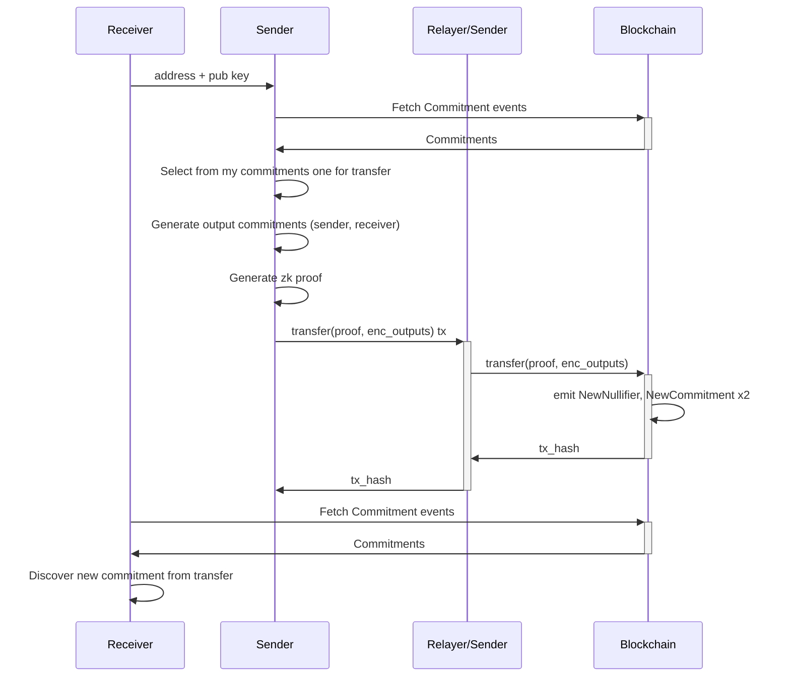
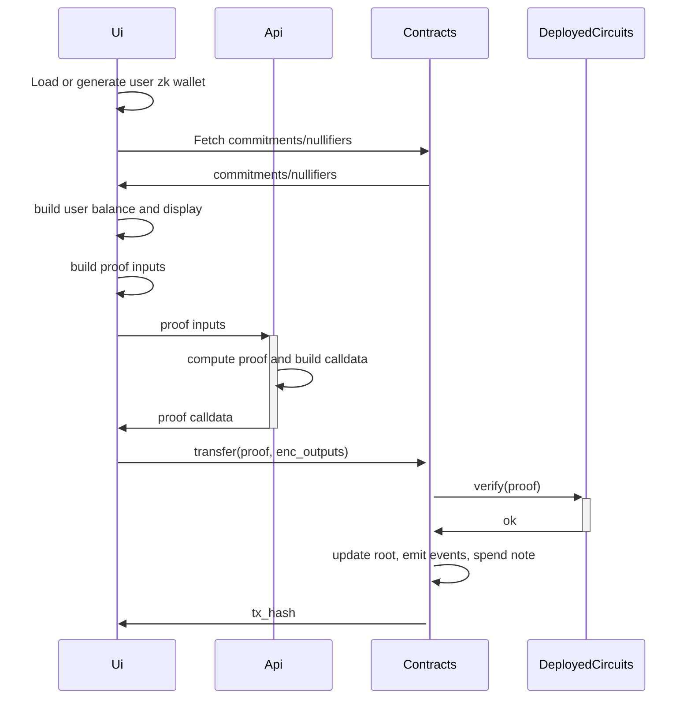
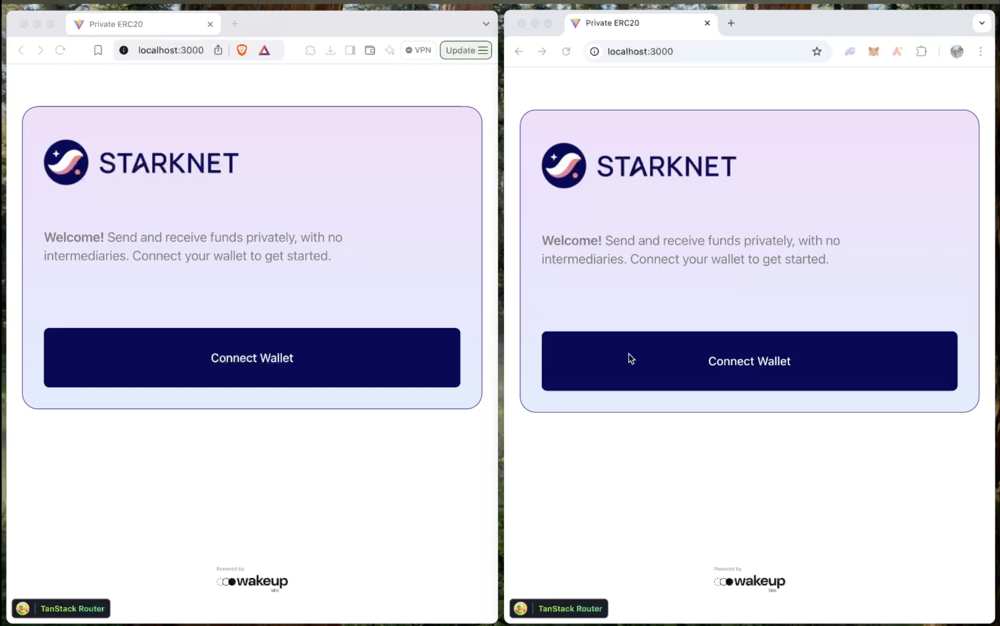
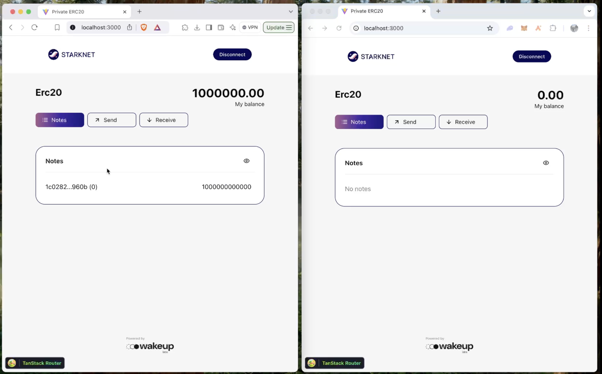
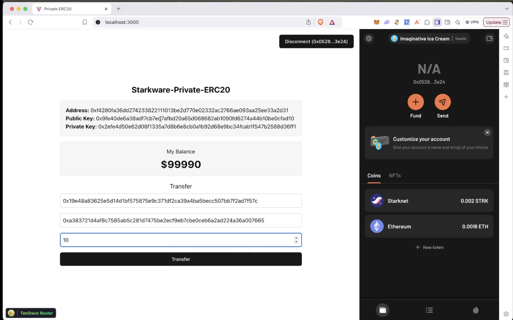
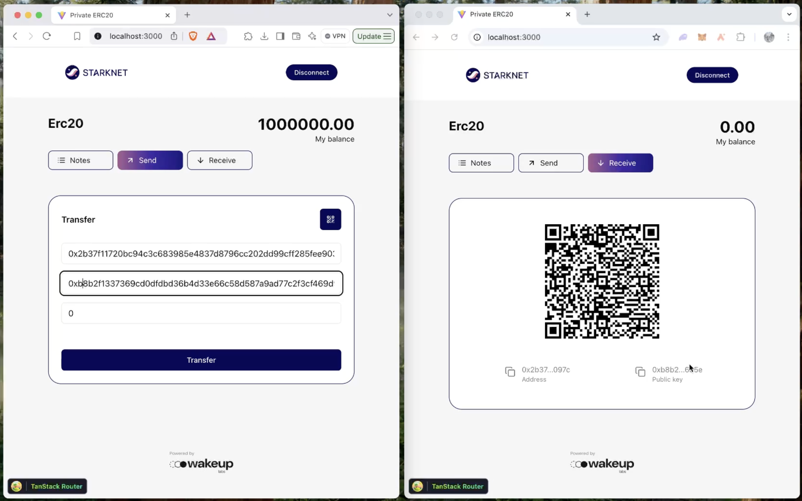
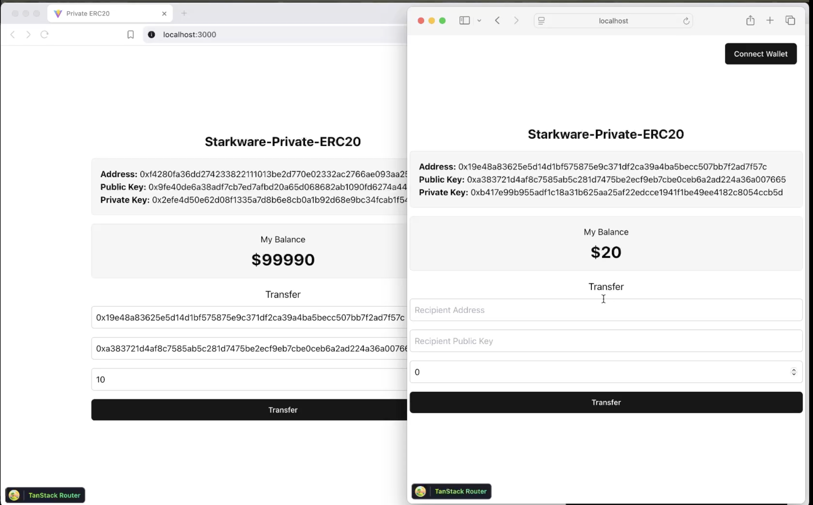

# Private ERC20

## Overview

Design is inspired in privacy pools like [tornado nova](https://github.com/tornadocash/tornado-nova/tree/b085ab398eaeefff98771f5dad893cb804d98e70) and [zcash](https://github.com/zcash/orchard)

## Definitions

### Note

A "note" represents ownership information over a certain amount of tokens. The hash of this information is called the commitment and is stored in the contract's Merkle tree. The user balance is the sum of these notes.

### Nullifier

The nullifier is a unique value derived from a note to prevent double-spending. It is significant because it can only be created by the owner and is unequivocally linked to a single note. This is achieved by using the hash of the note to prevent any attempt at double-spending.

### Keypairs

The user's wallet consists of an asymetric keypair build with sodium Curve25519. Certain relevant information required to use a note is encrypted with the owner's public key and published in the `NewCommitment` event. This ensures that only the user with the corresponding private key can access it. The public and private keys follow standard RSA conventions. For the address, we currently define it as `hash(private_key)` to quickly validate ownership in circuits, as there is no support for RSA key derivation in Noir. One alternative being explored is using [signatures](https://noir-lang.org/docs/reference/NoirJS/noir_js/functions/ecdsa_secp256k1_verify), though this feature is not yet implemented.

### Relayer

A relayer is a service that can further enhance user privacy. While blockchain calldata does not expose any data about amounts or zk addresses, submitting transactions directly reveals the user's Starknet wallet address, potentially leaving a trace of their participation. To address this, a relayer can submit transactions on behalf of users, effectively obscuring their wallet address and improving privacy.


## How it all works

### Initial Minting Process

Currently, the deployer is responsible for creating the first commitment by specifying the `MERKLE_TREE_INITIAL_ROOT` and emitting the first two notes. This sets the initial supply, and it is then up to the deployer to distribute the tokens. There is no minting process in place at this time.

### Balance discovery

To rediscover a user's commitment, the process works as follows:
1. Fetch all NewCommitment { commitment, enc_output, index } events (preferably already cached, so only the latest ones are fetched).
2. Fetch all NewNullifier { nullifier_hash } events (again, ideally cached, so only the most recent ones are fetched).
3. Iterate over the commitments:
   - Attempt decryption. If successful, derive the nullifier_hash and check whether it has already been used.
   - If the nullifier_hash hasn't been used, add the commitment to the pool of usable commitments and sum up the value.

### Transfer

On transfer one note is burned and 2 new notes are created, one for the sender change and one for the receiver.



Circuit checks
- The input commitment is included in the root and belongs to the sender.
- The nullifierHash is effectively the hash of the nullifier and is attached to the input commitment.
- Ensure no balance is mined or burned and so sum of value of input commitments is equal to sum of output commitments values.
- The output commitments are correct, including the amount and owner of each.
- The new root does not remove any elements from the tree.
- The new root contains both the new commitments.

Some clarifications:
- At the moment we limited input notes to just one, we can easily grow this number by just iterating checks and nullifications.
- Unlike `tornado-core` where the contract maintains and updates the merkle root with all the commitments, in this case we delegate that work to the circuits for cost efficiency and better compatibility of types and hashing functions.

### Application

There're several packages in the overall app and they interact this way:



Some clarifications:
- In this context, "circuits" refers to the deployed verifier generated using Garaga.
- The API is ideally not necessary and serves merely as a workaround of current garaga version 0.15.3 not supporting honk vk/proof calldata encoding. This seems to have been introduced in this pr https://github.com/keep-starknet-strange/garaga/pull/288 recently. Not yet published but we can try incorporating it.


## Demo

Current ux goes like this:

A new wallet is generated for the user per browser or one is recovered from local storage



User connects argent wallet to pay for transaction gas



Sender inputs receiver address and public key. Also fills amount



Confirm transaction in wallet. (Example transaction https://sepolia.voyager.online/tx/0x6c6b73fd34c45c05dc9ebdf168c99a0fe1d44fd5e983d7c2bc8187baec87b78?mtm_campaign=argent-redirect&mtm_source=argent&mtm_medium=referral)



Receiver discovers new note and sums up balance



# Deployments

## Deployments setup

Create the deployer account

```bash
just contracts-deployer-account-create

# address: 0x0528604705c912b3a6debc3bb63370659b884fb370191c9c48ccb59a9b9f3e24
# max_fee: 117743078418
# message: Account successfully created. Prefund generated address with at least <max_fee> STRK tokens or an equivalent amount of ETH tokens. It is good to send more in the case of higher demand.
```

Prefund generated address with at least <max_fee> STRK tokens or an equivalent amount of ETH tokens and then run

```bash
just contracts-deployer-account-deploy
```

## Circuits deployment

First make sure to update DEPTH accordingly in your circuit. Then generate the cairo contracts with:

```bash
just circuits-generate-verifier

(cd packages/circuits/transfer && nargo build)
(cd packages/circuits/transfer && bb write_vk_ultra_keccak_honk -b target/transfer.json -o target/vk.bin)
Finalized circuit size: 1035
Log dyadic circuit size: 11
(cd packages/circuits/transfer && garaga gen --system ultra_keccak_honk --vk target/vk.bin --project-name contracts)
⠧ Generating Smart Contract project for ProofSystem.UltraKeccakHonk using vk.bin...
Done!
Smart Contract project created:
/Users/matzapata/git-work/starkware/starkware-private-erc20/packages/circuits/transfer/contracts/
├── .tools-versions
├── Scarb.lock
├── Scarb.toml
├── src/
│   ├── honk_verifier.cairo
│   ├── honk_verifier_circuits.cairo
│   ├── honk_verifier_constants.cairo
│   └── lib.cairo
└── target/
    ├── CACHEDIR.TAG
    └── release/
        ├── contracts.starknet_artifacts.json
        ├── contracts_UltraKeccakHonkVerifier.compiled_contract_class.json
        └── contracts_UltraKeccakHonkVerifier.contract_class.json
You can now test the main endpoint of the verifier using a proof and `garaga calldata` command.
```

Declare and deploy the contract with 

```bash
just circuits-declare-verifier transfer

# class_hash: 0x0521d13e079f65ee353914317bc1731213766906f1131ee68ed53ec9bb017cbf
# transaction_hash: 0x0382fa1ad47d36c8e1e1c2bb68884c497f177a246bad06e80d7dedb2c1e0a8c0

# To see declaration details, visit:
# class: https://sepolia.starkscan.co/class/0x0521d13e079f65ee353914317bc1731213766906f1131ee68ed53ec9bb017cbf
# transaction: https://sepolia.starkscan.co/tx/0x0382fa1ad47d36c8e1e1c2bb68884c497f177a246bad06e80d7dedb2c1e0a8c0

just circuits-deploy-verifier transfer 0x0521d13e079f65ee353914317bc1731213766906f1131ee68ed53ec9bb017cbf

# contract_address: 0x073a29b78d1aa45a9c3fab87f93d682134a6ffe1a010214a493c7edc16587143
# transaction_hash: 0x05d62d45892eeb50aaf194af843b00ae79c20e5a6592485ff9badb318f79a024

# To see deployment details, visit:
# contract: https://sepolia.starkscan.co/contract/0x073a29b78d1aa45a9c3fab87f93d682134a6ffe1a010214a493c7edc16587143
# transaction: https://sepolia.starkscan.co/tx/0x05d62d45892eeb50aaf194af843b00ae79c20e5a6592485ff9badb318f79a024
```

## Contracts deployment

Deployment with just command (Same for verifier if needed). First go to `src/privado/constants` and update properly.

```bash
just contracts-declare-privado

# class_hash: 0x008ccb72ab0cc84a8afd2644a5c1d55b13d9e91b05ef0c721aacd9ee2e3d5028
# transaction_hash: 0x02132e8d9d7285fc9dfc65ae5fe8a4c28863de846e530f571ac8af3b8245fa9c

# To see declaration details, visit:
# class: https://sepolia.starkscan.co/class/0x008ccb72ab0cc84a8afd2644a5c1d55b13d9e91b05ef0c721aacd9ee2e3d5028
# transaction: https://sepolia.starkscan.co/tx/0x02132e8d9d7285fc9dfc65ae5fe8a4c28863de846e530f571ac8af3b8245fa9c

just contracts-deploy-privado 0x008ccb72ab0cc84a8afd2644a5c1d55b13d9e91b05ef0c721aacd9ee2e3d5028

# contract_address: 0x0259a6a2b5e664b71518462d9857944982b76f1e49d57abf14b6c64dd5b5894e
# transaction_hash: 0x01c471bc2156aa73c7cad8a91d910a0cc72f3954300d28ab3e7baa8d9ff213d2

# To see deployment details, visit:
# contract: https://sepolia.starkscan.co/contract/0x0259a6a2b5e664b71518462d9857944982b76f1e49d57abf14b6c64dd5b5894e
# transaction: https://sepolia.starkscan.co/tx/0x01c471bc2156aa73c7cad8a91d910a0cc72f3954300d28ab3e7baa8d9ff213d2
```


## Infra deployment

Create `.env` from `.env.example`

Compile circuits if not already compiled and take it to `api/circuits/transfer`

```
circuits/
   transfer/
      src/
         ...
         main.noir
      target/
         transfer.json
         vk.bin
      Nargo.toml
```

Deploy to aws with:

`npx sst deploy --stage staging`
