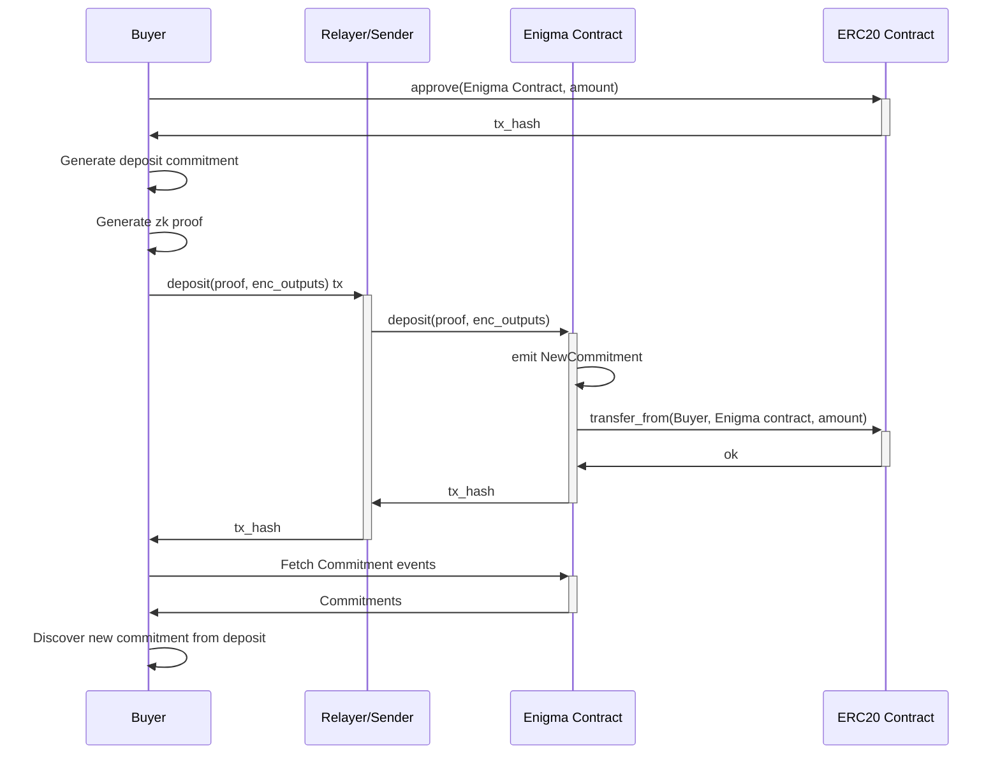
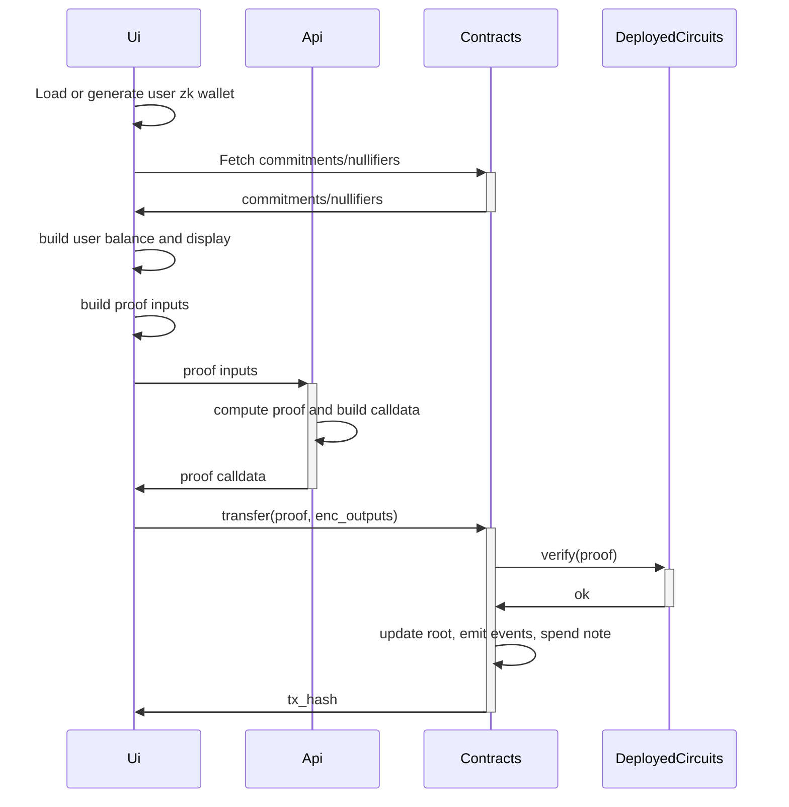
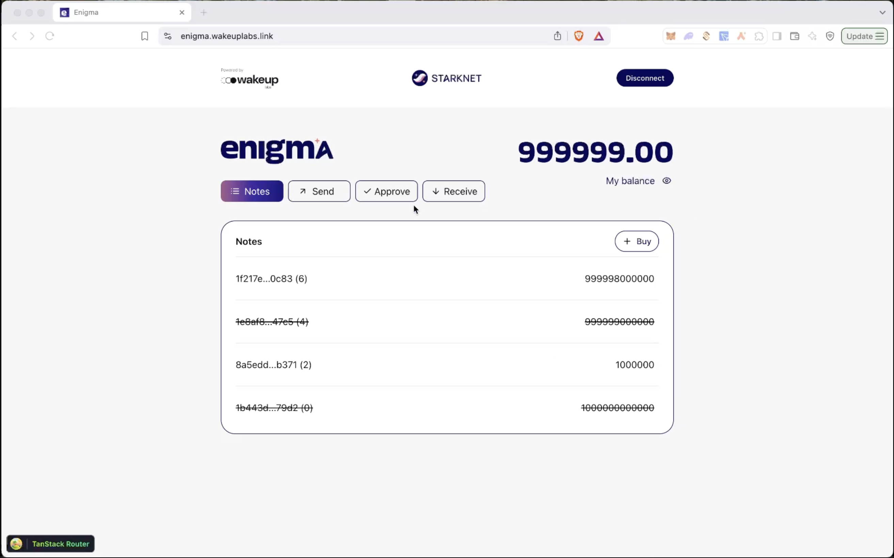
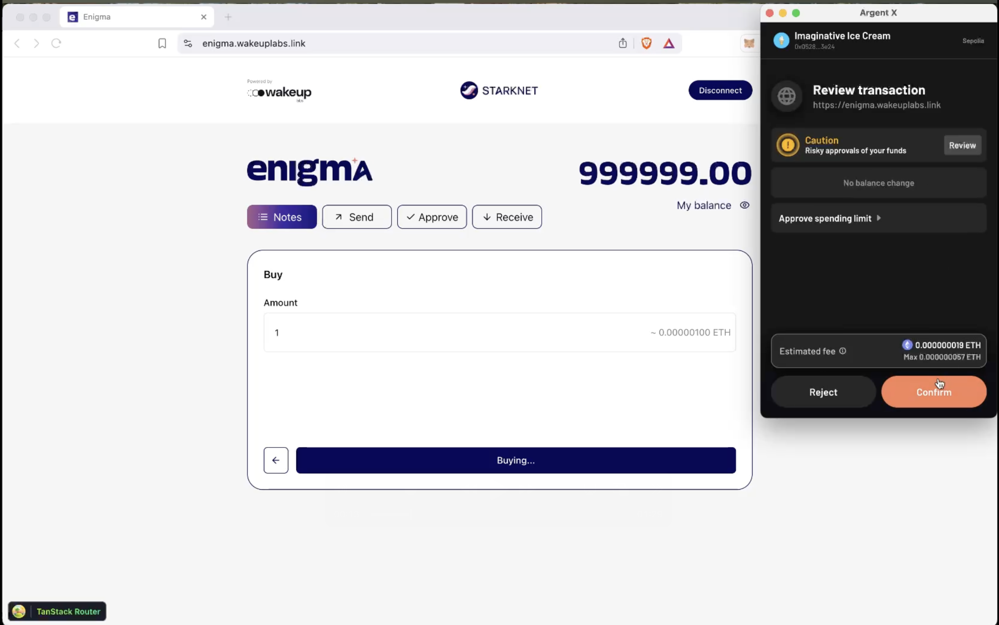
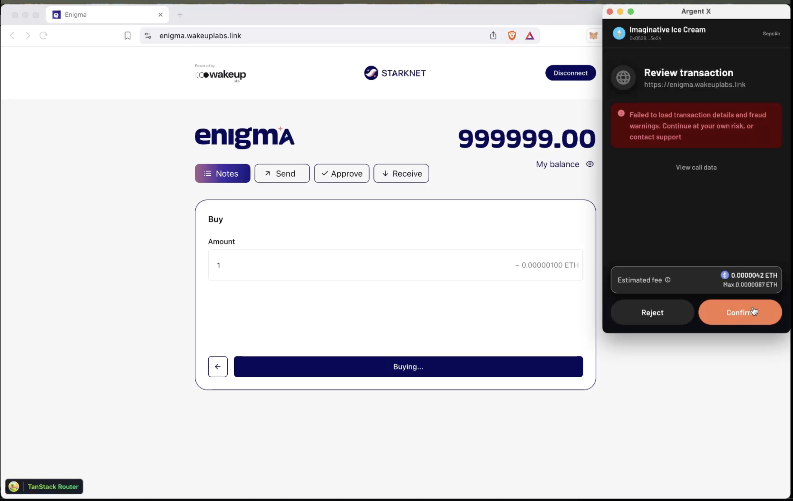

# Enigma

## Overview

This is a PoC for a **private token based on the ERC-20 standard**, with **ZK circuits**, contracts, and a frontend interface implementing methods such as transfer, approve, and transfer_from, among others. Using a notes system and asymmetric encryption, a design was proposed and implemented to execute these methods privately, without revealing transaction amounts or the users involved.

For this, **Noir** was used for the circuits, **Garaga** for verifier code generation, **Cairo** for the contract, and **TypeScript with React** for the frontend application. The frontend and API were deployed using **AWS**, and the contracts were deployed on the **Starknet chain**.

### Disclaimer

This is a project for demo purposes, developed within the framework of NoirCon 1 at ETH Denver.

At this stage, it is in PoC format and does not include all compliance, security, and edge case checks required. It will require many additional QA rounds, extra development & design iterations for it to be mainnet-ready.

## Definitions

### Note

A "note" represents ownership information over a certain amount of tokens. The hash of this information is called the commitment and is stored in the contract's Merkle tree. The user balance is the sum of these notes.

### Nullifier

The nullifier is a unique value derived from a note to prevent double-spending. It is significant because it can only be created by the owner/viewer and is unequivocally linked to a single note. 

### Keypairs

The user's wallet consists of 2 asymmetric keypairs built with sodium Curve25519. There's a `Viewing Keypair` and a `Owner Keypair`. Certain relevant information required to use a note is encrypted with the `Viewing Keypair` public key and published in the `NewCommitment` event. This ensures that only those with the viewing key can see the commitment details like amount and address. For the `address`, we currently define it as `hash(Owner Keypair Private Key)` to quickly validate ownership in circuits, as there is no support for asymmetric key derivation in Noir. One alternative being explored is using [signatures](https://noir-lang.org/docs/reference/NoirJS/noir_js/functions/ecdsa_secp256k1_verify), though this feature is not yet implemented. 

In summary, there're 2 Keypairs for each user, a Viewing Keypair, used to encrypt access data that will be published onchain. And an Owner Keypair that will be used to proof ownership of a zk address.

And so user sharable wallet looks something like this
- Public key: `PublicKey(ViewingKeypair)`
- Address: `Hash(OwnerPrivateKey)`

### Relayer

A relayer is a service that can further enhance user privacy. While blockchain calldata does not expose any data about amounts or zk addresses, submitting transactions directly reveals the user's Starknet wallet address, potentially leaving a trace of their participation. To address this, a relayer can submit transactions on behalf of users, effectively obscuring their wallet address and improving privacy.


## How it all works

### Initial Minting Process

Currently, the deployer is responsible for creating the first commitment by specifying the `MERKLE_TREE_INITIAL_ROOT` and emitting the first two notes. This sets the initial supply, and it is then up to the deployer to distribute the tokens. There is no minting process in place at this time.

### Balance discovery

To rediscover a user's commitment, the process works as follows:
1. Fetch all NewCommitment { commitment, enc_output, index } events
2. Fetch all NewNullifier { nullifier } events.
3. Iterate over the commitments:
   - Attempt decryption. If successful, derive the nullifier and check whether it has already been used.
   - If the nullifier hasn't been used, add the commitment to the pool of usable commitments and sum up the value.

### Transfer

On transfer one note is burned and 2 new notes are created, one for the sender change and one for the receiver.


Circuit checks
- The input commitment is included in the root and belongs to the sender.
- The nullifierHash is effectively the hash of the nullifier and is attached to the input commitment.
- Ensure no balance is mined or burned and so sum of value of input commitments is equal to sum of output commitments values.
- The output commitments are correct, including the amount and owner of each.
- The new root does not remove any elements from the tree.
- The new root contains both the new commitments.

Some clarifications:
- At the moment we limited input notes to just one, we can easily grow this number by just iterating checks and nullifications.
- Unlike `tornado-core` where the contract maintains and updates the merkle root with all the commitments, in this case we delegate that work to the circuits for cost efficiency and better compatibility of types and hashing functions.

### Approve / TransferFrom

`transfer_from` works pretty similar to `transfer`. 2 Notes will be created (one for the receiver and 1 for the change of the owner) and one nullified. The main difference with `transfer` is the limit on how much we can transfer and who actually does this transfer. 

As per the limit of amount we store an `allowance_hash` onchain. This is the `hash(owner_address, spender_address, amount)` and we verify through circuits this hashes transition is correct. We store this associated to `hash(owner_address, spender_address)`.

As per allowing a third party to do the transfers we'll do that by verifying spender owns `spender_address` specified in the `allowance_hash`. We also need to allow spender to know which commitments to use for payment to properly assemble the output commitments and nullifiers. For this last thing we have 2 options:
- Sharing with spender specific commitment details. This is the most private option but also the most limited, if new commitments were coming in, spender won't be capable fo using them, or if user uses the shared commitments same. Also requires having enough balance at the moment of the approval.
- Sharing the viewing key with the spender. This does reveals more data about the owner, as the spender will be capable of seeing all incoming commitments as well as all history commitment. And so requires a bigger level of trust on spender as well for keeping the key safe. On the positive side this can work as a conventional approve system where spender has a limit and can use balance however as long as he doesn't break that limit. Also to preserve privacy user can always rotate the viewing keys.

A diagram of the flow described above:


Abbreviations:
- `ah` = `allowance_hash`
- `ri` = `relationship_id`

Some clarifications:
- An easy improvement for current system and probable a necessary one we're skipping in this POC is to use indexers like [thegraph.com](https://thegraph.com) to query events

### Deposit

A deposit works similarly to a regular transfer, except that there's only one note being created and no notes being nullified. Conceptually, you can think of it as “burning” ETH from the user’s balance and creating a new commitment in the Enigma contract.



Circuit checks
- The buyer commitment is correct, including the correct amount and owner.
- The new root does not remove any elements from the tree.
- The new root contains the new commitment.

Some clarifications:
- For each 1 ETH deposited, the user receives 1,000,000 ENG

### Compliance proposition

If this project ever goes to production, it should first add compliance checks to ensure that every functionality complies with the laws in force worldwide.
The simplest and most direct approach to addressing compliance is by implementing a backdoor that allows the contract owner to disclose user information to authorities when required. This can be achieved by mandating all users to share viewing keys with the entity managing the contract.

A practical method for this is asymmetric encryption, where users encrypt their viewing private key using the entity’s public key before submitting them. To ensure correctness, we could validate the encryption through zk circuits and restrict contract functionality to only those accounts that have shared their keys—both for senders and receivers.

With this setup, the entity can maintain a cold wallet, ensuring that all data remains private while still being accessible when necessary.

Another alternatives can be using algorithmic checks on wallets at the moment of entering and exiting the pool, similar to what [Railway](https://www.railway.xyz/) does with [Railgun](https://docs.railgun.org/wiki/assurance/private-proofs-of-innocence). 

### Application

There're several packages that form the application and they interact this way:



Some clarifications:
- This is overall the same flow for all methods
- In this context, "circuits" refers to the deployed verifier generated using Garaga.
- The API is ideally not necessary and serves merely as a workaround of current garaga version 0.15.3 not supporting honk vk/proof calldata encoding. This seems to have been introduced in this pr https://github.com/keep-starknet-strange/garaga/pull/288 recently. Not yet published but we can try incorporating it.
- An easy improvement for current system and probable a necessary one we're skipping in this POC is to use indexers like [thegraph.com](https://thegraph.com) to query events
- Design is inspired in privacy pools like [tornado nova](https://github.com/tornadocash/tornado-nova/tree/b085ab398eaeefff98771f5dad893cb804d98e70) and [zcash](https://github.com/zcash/orchard)


## Demo

### Transfer

In this example we show sender in the left and receiver in the right, not necessary in the same machine but just for demo porpoises. Full video available at `/assets/demo/transfer/demo.mov`

User connects argent wallet to pay for transaction gas. A new zk wallet is generated for the user per browser or one is recovered from local storage


User can inspect the commitments that form their balance


Sender scans receiver qr code and so automatically filling address and public key


Enter amount and click transfer. Then confirm transaction in wallet. (Example transaction https://sepolia.voyager.online/tx/0x6c6b73fd34c45c05dc9ebdf168c99a0fe1d44fd5e983d7c2bc8187baec87b78?mtm_campaign=argent-redirect&mtm_source=argent&mtm_medium=referral)


A little time after receiver has balance available. They can also inspect nullified commitment for sender and new commitment for receiver


### Approve and transfer_from

For this demo we setup one wallet for the owner in the left and one for the spender in the right. In this case owner will approve spender and this last one will transfer tokens to himself. You can find the whole video at `/assets/demo/transfer/image-approve.mov`


So first, approver will go to the approve tab and enter or scan spender account details 


Then amount and optionally check `Share viewing key`. As states before this will give the spender vieiwing access through the viewing key itself, so user should be aware of this privacy exposure and weight weather or not this kind of approve is desired. The alternative without sharing the viewing key works as well but it'll limit the approve to the notes the user has at the moment, if he spends them, spender won't have balance, if he receives any new one, spender won't see them.


Then transaction is prompted to user to pay for gas, this wallet is not associated to the zk wallet, so it's just any wallet that can pay the gas. Here the transaction generated https://sepolia.voyager.online/tx/0x63180f22982c6d5b13bd1ab7873a1fac5c3a4f9e14b6225d500fdc5b0896df8


Once the transaction is mined, the spender can start moving approved funds. He goes to the transfer tab and inputs in "From" the owner details, in "To" the receiver (In this case spender himself) and "amount". 


Pays the gas for transfer_from call. Example transaction generated https://sepolia.voyager.online/tx/0x06a514c40abd1fbc5c6654c1492a391a4a7209d6daa03d880c271ad998f00924


And once transaction is mined we can see balance change reflected


We can continue doing transfers until spending all the allowance but we can never surpass it like in this case:


### Deposit / Buy

Now we'll showcase the user experience while acquiring tokens. You can find the full video at `./assets/demo/deposit/demo.mov`

In this case only one wallet is required for the demo. We'll note the user balance is 999999.0 ENG and click on "Buy".



Then enter amount we want to "Buy", noting the amount of eth required


Approve eth for the contract



Then the buy operation itself



And lastly just wait for the transaction to be mined and the new balance to be reflected


# Deployments


Sepolia deployment

- UI: [https://enigma.wakeuplabs.link](https://enigma.wakeuplabs.link)
- TOKEN_ADDRESS: `0x00ff4641b2fac61707fbc04766ec0986606d68e5dca02d688c1ce839d7a41396`
- TRANSFER_VERIFIER_ADDRESS: `0x024c512b2b7649ce7fb4ecc26e161312a5fb07b4253bcf0fa2dd250a430cd467`
- APPROVE_VERIFIER_ADDRESS: `0x028236f4aad88c151a9776c3b23427c96e841e8d1f3885f94d5fd8d8039f7371`
- TRANSFER_FROM_VERIFIER_ADDRESS: `0x0086fe3a1c7cab01a7551b4ce095fae9bc5a85ccefb34ce90bea444e281c3949`


## Deployments setup

Create the deployer account

```bash
just contracts-deployer-account-create

# address: 0x0528604705c912b3a6debc3bb63370659b884fb370191c9c48ccb59a9b9f3e24
# max_fee: 117743078418
# message: Account successfully created. Prefund generated address with at least <max_fee> STRK tokens or an equivalent amount of ETH tokens. It is good to send more in the case of higher demand.
```

Prefund generated address with at least <max_fee> STRK tokens or an equivalent amount of ETH tokens and then run

```bash
just contracts-deployer-account-deploy
```

## Circuits deployment

### transfer

First make sure to update DEPTH accordingly in your circuit. Then generate the cairo contracts with:

```bash
just circuits-generate-verifier transfer

# (cd packages/circuits/transfer && nargo build)
# (cd packages/circuits/transfer && bb write_vk_ultra_keccak_honk -b target/transfer.json -o target/vk.bin)
# Finalized circuit size: 3736
# Log dyadic circuit size: 12
# (cd packages/circuits/transfer && garaga gen --system ultra_keccak_honk --vk target/vk.bin --project-name contracts)
# ⠦ Generating Smart Contract project for ProofSystem.UltraKeccakHonk using vk.bin...
# Done!
# Smart Contract project created:
# /Users/matzapata/git-work/starkware/starkware-private-erc20/packages/circuits/transfer/con
# tracts/
# ├── .tools-versions
# ├── Scarb.lock
# ├── Scarb.toml
# ├── src/
# │   ├── honk_verifier.cairo
# │   ├── honk_verifier_circuits.cairo
# │   ├── honk_verifier_constants.cairo
# │   └── lib.cairo
# └── target/
#     ├── CACHEDIR.TAG
#     └── release/
#         ├── contracts.starknet_artifacts.json
#         ├── contracts_UltraKeccakHonkVerifier.compiled_contract_class.json
#         └── contracts_UltraKeccakHonkVerifier.contract_class.json
# You can now test the main endpoint of the verifier using a proof and `garaga calldata` 
# command.
```

Declare and deploy the contract with 

```bash
just circuits-declare-verifier transfer

# class_hash: 0x00918e2c5aa72bd570ad01b48e03f9717ff767112bc67d3ea9cb9ee148ef93a4
# transaction_hash: 0x074cc34b64d564579197f7817a16a9e966dabab15ce5cd9d4816ee62786a394c

# To see declaration details, visit:
# class: https://sepolia.starkscan.co/class/0x00918e2c5aa72bd570ad01b48e03f9717ff767112bc67d3ea9cb9ee148ef93a4
# transaction: https://sepolia.starkscan.co/tx/0x074cc34b64d564579197f7817a16a9e966dabab15ce5cd9d4816ee62786a394c

just circuits-deploy-verifier transfer 0x00918e2c5aa72bd570ad01b48e03f9717ff767112bc67d3ea9cb9ee148ef93a4

# contract_address: 0x024c512b2b7649ce7fb4ecc26e161312a5fb07b4253bcf0fa2dd250a430cd467
# transaction_hash: 0x06b4e0a20f2513e375ce6a3d260db998225f1393fcdc156bbb6632676987f5de

# To see deployment details, visit:
# contract: https://sepolia.starkscan.co/contract/0x024c512b2b7649ce7fb4ecc26e161312a5fb07b4253bcf0fa2dd250a430cd467
# transaction: https://sepolia.starkscan.co/tx/0x06b4e0a20f2513e375ce6a3d260db998225f1393fcdc156bbb6632676987f5de
```


### transfer_from

First make sure to update DEPTH accordingly in your circuit. Then generate the cairo contracts with:

```bash
just circuits-generate-verifier transfer_from

# (cd packages/circuits/transfer_from && nargo build)
# (cd packages/circuits/transfer_from && bb write_vk_ultra_keccak_honk -b target/transfer_from.json -o target/vk.bin)
# Finalized circuit size: 1109
# Log dyadic circuit size: 11
# (cd packages/circuits/transfer_from && garaga gen --system ultra_keccak_honk --vk target/vk.bin --project-name contracts)
# ⠦ Generating Smart Contract project for ProofSystem.UltraKeccakHonk using vk.bin...
# Done!
# Smart Contract project created:
# /Users/matzapata/git-work/starkware/starkware-private-erc20/packages/circuits/transfer_fro
# m/contracts/
# ├── .tools-versions
# ├── Scarb.toml
# └── src/
#     ├── honk_verifier.cairo
#     ├── honk_verifier_circuits.cairo
#     ├── honk_verifier_constants.cairo
#     └── lib.cairo
# You can now test the main endpoint of the verifier using a proof and `garaga calldata` 
# command.
```

Declare and deploy the contract with 

```bash
just circuits-declare-verifier transfer_from

# class_hash: 0x076b2649928b5c1e59c58555ff1d079b096f0813996466b000e286cf49643b80
# transaction_hash: 0x079449212c3a6366346d2a7f0726b9b13ea77ca2c8c5899a8da96da9c120875f

# To see declaration details, visit:
# class: https://sepolia.starkscan.co/class/0x076b2649928b5c1e59c58555ff1d079b096f0813996466b000e286cf49643b80
# transaction: https://sepolia.starkscan.co/tx/0x079449212c3a6366346d2a7f0726b9b13ea77ca2c8c5899a8da96da9c120875f

just circuits-deploy-verifier transfer_from 0x076b2649928b5c1e59c58555ff1d079b096f0813996466b000e286cf49643b80

# contract_address: 0x0086fe3a1c7cab01a7551b4ce095fae9bc5a85ccefb34ce90bea444e281c3949
# transaction_hash: 0x00019288b8ef30d5985b189f80f9373bfe5d15777076080eb4e5b8c3cf5664d3

# To see deployment details, visit:
# contract: https://sepolia.starkscan.co/contract/0x0086fe3a1c7cab01a7551b4ce095fae9bc5a85ccefb34ce90bea444e281c3949
# transaction: https://sepolia.starkscan.co/tx/0x00019288b8ef30d5985b189f80f9373bfe5d15777076080eb4e5b8c3cf5664d3
```


### approve

First make sure to update DEPTH accordingly in your circuit. Then generate the cairo contracts with:

```bash
just circuits-generate-verifier approve

# (cd packages/circuits/approve && nargo build)
# (cd packages/circuits/approve && bb write_vk_ultra_keccak_honk -b target/approve.json -o target/vk.bin)
# Finalized circuit size: 251
# Log dyadic circuit size: 8
# (cd packages/circuits/approve && garaga gen --system ultra_keccak_honk --vk target/vk.bin --project-name contracts)
# ⠦ Generating Smart Contract project for ProofSystem.UltraKeccakHonk using vk.bin...
# Done!
# Smart Contract project created:
# /Users/matzapata/git-work/starkware/starkware-private-erc20/packages/circuits/approve/cont
# racts/
# ├── .tools-versions
# ├── Scarb.toml
# └── src/
#     ├── honk_verifier.cairo
#     ├── honk_verifier_circuits.cairo
#     ├── honk_verifier_constants.cairo
#     └── lib.cairo
# You can now test the main endpoint of the verifier using a proof and `garaga calldata` 
# command.
```

Declare and deploy the contract with 

```bash
just circuits-declare-verifier approve

# class_hash: 0x0005ab98bd08bbfc4fac40994f37bab41528ea8ee4eefbbcc9cf7244bf7782d2
# transaction_hash: 0x01cd9e75a8504091b0438cb6dfc9bb9d4c7ca597927aefb764ba0980272c1907

# To see declaration details, visit:
# class: https://sepolia.starkscan.co/class/0x0005ab98bd08bbfc4fac40994f37bab41528ea8ee4eefbbcc9cf7244bf7782d2
# transaction: https://sepolia.starkscan.co/tx/0x01cd9e75a8504091b0438cb6dfc9bb9d4c7ca597927aefb764ba0980272c1907

just circuits-deploy-verifier approve 0x0005ab98bd08bbfc4fac40994f37bab41528ea8ee4eefbbcc9cf7244bf7782d2

# contract_address: 0x028236f4aad88c151a9776c3b23427c96e841e8d1f3885f94d5fd8d8039f7371
# transaction_hash: 0x075498d0bfa5c3be4afe4181c4d8c96c5c9fa69cbbe50a3ed8d8e294dfcc1d35

# To see deployment details, visit:
# contract: https://sepolia.starkscan.co/contract/0x028236f4aad88c151a9776c3b23427c96e841e8d1f3885f94d5fd8d8039f7371
# transaction: https://sepolia.starkscan.co/tx/0x075498d0bfa5c3be4afe4181c4d8c96c5c9fa69cbbe50a3ed8d8e294dfcc1d35
```

### deposit

First make sure to update DEPTH accordingly in your circuit. Then generate the cairo contracts with:

```bash
just circuits-generate-verifier deposit

# (cd packages/circuits/deposit && nargo build)
# (cd packages/circuits/deposit && bb write_vk_ultra_keccak_honk -b target/deposit.json -o target/vk.bin)
# Finalized circuit size: 2208
# Log dyadic circuit size: 12
# (cd packages/circuits/deposit && garaga gen --system ultra_keccak_honk --vk target/vk.bin --project-name contracts)
# ⠧ Generating Smart Contract project for ProofSystem.UltraKeccakHonk using vk.bin...
# Done!
# Smart Contract project created:
# /Users/matzapata/git-work/starkware/starkware-private-erc20/packages/circuits/deposit/cont
# racts/
# ├── .tools-versions
# ├── Scarb.toml
# └── src/
#     ├── honk_verifier.cairo
#     ├── honk_verifier_circuits.cairo
#     ├── honk_verifier_constants.cairo
#     └── lib.cairo
# You can now test the main endpoint of the verifier using a proof and `garaga calldata` 
# command.
```

Declare and deploy the contract with 

```bash
just circuits-declare-verifier deposit

# class_hash: 0x044a2b6320da0625a4a7045378a5df8b02fadaed614d0cdcb33ec863f77e0301
# transaction_hash: 0x023ed9770ca8352a131f0557e92fb2850a2f760018abb8a0eeb41c6362200ded

# To see declaration details, visit:
# class: https://sepolia.starkscan.co/class/0x044a2b6320da0625a4a7045378a5df8b02fadaed614d0cdcb33ec863f77e0301
# transaction: https://sepolia.starkscan.co/tx/0x023ed9770ca8352a131f0557e92fb2850a2f760018abb8a0eeb41c6362200ded

just circuits-deploy-verifier deposit 0x044a2b6320da0625a4a7045378a5df8b02fadaed614d0cdcb33ec863f77e0301

# contract_address: 0x0564cb6171edc5ef5d9738c7c7d00544459b98e23d8afebe137d87e165fcb144
# transaction_hash: 0x06c476e9cad3cf6f5597f068f6f2a0294d41160c2233891b42eda0e8b317fd00

# To see deployment details, visit:
# contract: https://sepolia.starkscan.co/contract/0x0564cb6171edc5ef5d9738c7c7d00544459b98e23d8afebe137d87e165fcb144
# transaction: https://sepolia.starkscan.co/tx/0x06c476e9cad3cf6f5597f068f6f2a0294d41160c2233891b42eda0e8b317fd00
```

## Contracts deployment

Deployment with just command (Same for verifier if needed). First go to `src/privado/constants` and update properly.

```bash
just contracts-declare

# class_hash: 0x01ff74bc2838b0744d431a14084ff4a398db9e0281ff31b6ff2f96346d41f742
# transaction_hash: 0x055f24b05fc0e8e0523b065e1d0b7709d7a31151d909950568e746dcca322417

# To see declaration details, visit:
# class: https://sepolia.starkscan.co/class/0x01ff74bc2838b0744d431a14084ff4a398db9e0281ff31b6ff2f96346d41f742
# transaction: https://sepolia.starkscan.co/tx/0x055f24b05fc0e8e0523b065e1d0b7709d7a31151d909950568e746dcca322417

just contracts-deploy 0x01ff74bc2838b0744d431a14084ff4a398db9e0281ff31b6ff2f96346d41f742

# contract_address: 0x035ba4ea1ef4afc87f79c3e15277f8d8238787a1298fb161942b8802446ad0bb
# transaction_hash: 0x05ffd026639fb96c4a7e571d5a4b6550bfd9a000b1728124eab87eae8b1c6a26

# To see deployment details, visit:
# contract: https://sepolia.starkscan.co/contract/0x035ba4ea1ef4afc87f79c3e15277f8d8238787a1298fb161942b8802446ad0bb
# transaction: https://sepolia.starkscan.co/tx/0x05ffd026639fb96c4a7e571d5a4b6550bfd9a000b1728124eab87eae8b1c6a26
```


## Infra deployment

Create `.env` from `.env.example`

Compile circuits if not already compiled and take it to `api/circuits/transfer`

```
circuits/
   transfer/
      src/
         ...
         main.noir
      target/
         transfer.json
         vk.bin
      Nargo.toml
```

Deploy to aws with:

`npx sst deploy --stage staging`


